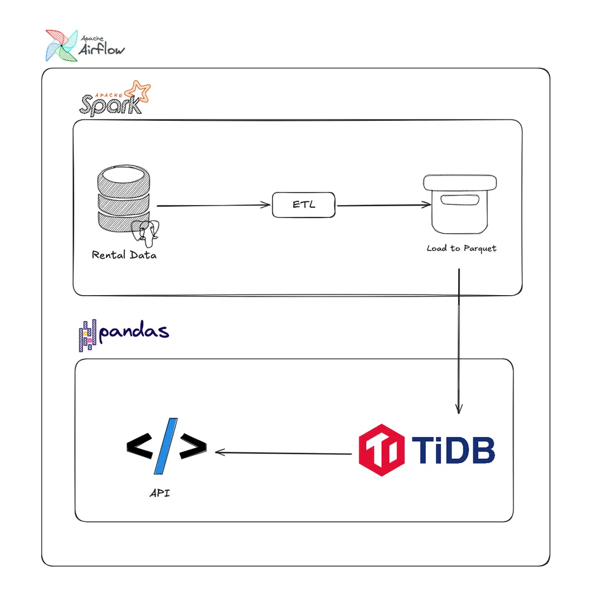
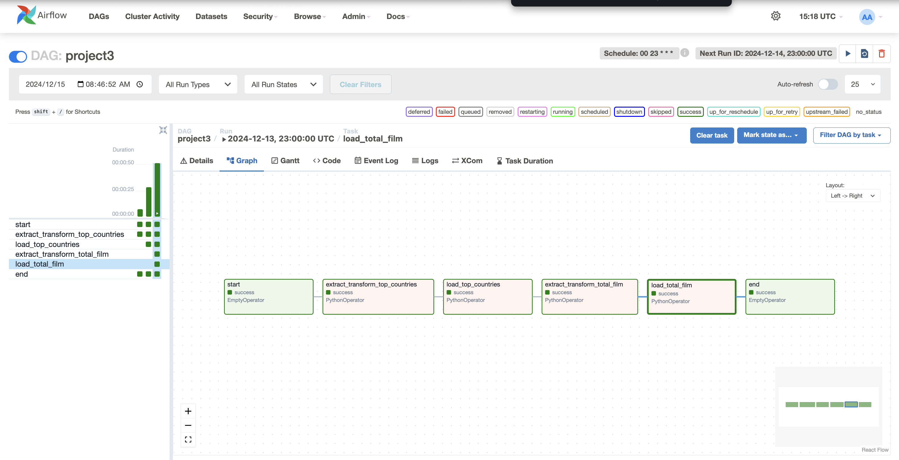
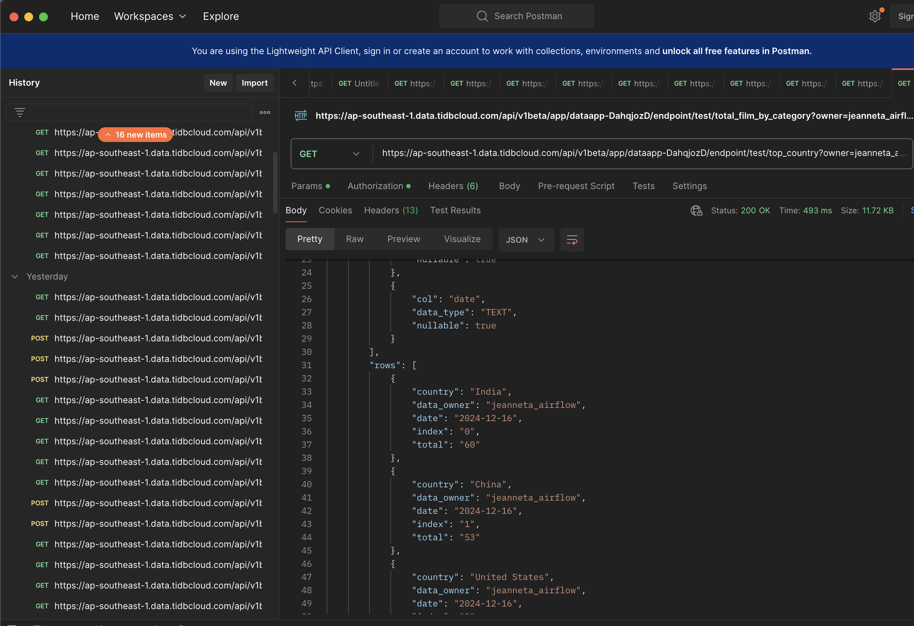
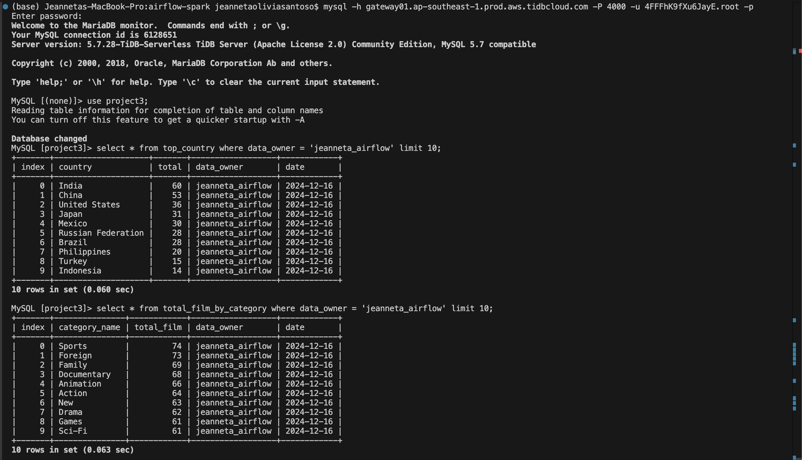

# Batch Processing Using Apache Airflow & Spark in a Single Docker Container

References:
https://blog.devgenius.io/how-to-install-apache-airflow-apache-spark-in-a-single-docker-container-1fa4f6fba3c7 
https://github.com/MSinggihP/airflow-docker-spark/tree/main

### **Introduction**

This project, **Batch Processing Using Airflow and Spark**, demonstrates the seamless integration of **Apache Airflow** and **Apache Spark** to handle batch processing workflows. Using these tools, this project showcases how to orchestrate ETL (Extract, Transform, Load) pipelines, optimize data transformations, and securely manage connections across different databases.

Through the power of **Airflow's workflow management** and **Spark's distributed data processing capabilities**, this project is designed to process large-scale data efficiently, automate repetitive tasks, and achieve scalable performance.

### **Key Highlights**

- **End-to-End Data Pipeline**: From extracting raw data to transforming it using Spark and loading the results into a database.
- **Airflow Orchestration**: Automate and schedule data workflows using **Apache Airflow**.
- **Spark for Data Transformation**: Harness the speed and scalability of **Apache Spark** for SQL-like data transformations.
- **Dockerized Environment**: Run Airflow and Spark together in a single **Docker container** for seamless integration and scalability.
- **Database Connectivity with Airflow**: Use Airflow's UI to securely manage Postgres and MySQL (TiDB) credentials for data extraction and loading.
- **Reusability and Modularity**: Well-defined modular scripts to make the ETL processes reusable and easy to extend.

### Tools and Technologies

1. **Airflow on Local**: Workflow orchestration.
2. **Apache Spark**: Data transformation and processing.
3. **Postgres**: Data warehouse (source database).
4. **TiDB (MySQL)**: Target database for analysis results.
5. **Docker**: Containerization of the application.
6. **Python (Pandas, SQLAlchemy)**: For integration and data loading.
7. **VSCode**: Development environment.
8. **DBeaver**: Database management.
9. **Postman**: API testing.

### Dataset

https://www.kaggle.com/datasets/kapturovalexander/pagila-postgresql-sample-database

### **Project Architecture Overview**



### **Pipeline Overview**

1. **Data Extraction**: Data is securely pulled from **PostgreSQL** using Airflow connections.
2. **Data Transformation**: Transformation logic is executed in **Apache Spark** using PySpark and SQL queries.
3. **Data Loading**: Processed data is written to **MySQL (TiDB)** for storage and further use.

**Practical Use Cases**: Analyze real-world data through two practical scenarios:

- **Top Countries by Users Workflow**:
    - Extract location and customer data from PostgreSQL.
    - Transform data in Spark to calculate user count per country.
    - Load results into MySQL for reporting.
- **Total Films by Category Workflow**:
    - Extract film category and mapping data from PostgreSQL.
    - Transform data in Spark to calculate the number of films per category.
    - Load results into MySQL for analysis.

### Step by Step Guide:

### Option 1: Clone the Repository

To get started, you can simply clone this repository and follow the instructions below:

```bash
git clone https://github.com/jeanneta/Batch-Processing-Using-Apache-Airflow-Spark.git
cd Batch-Processing-Using-Apache-Airflow-Spark
```

### Option 2: Detailed Hands-On Setup

1. Create your own project folder

Project Structure:

```python
airflow-spark
├── dags/
│   ├── modules    
│	    ├── etl.py    # DAG for Top Countries analysis and Total Films analysis
│   ├── project3.py    
├── docker-compose.yaml          
├── Dockerfile                 
├── requirements.txt            
└── .env                  
```

2. Creating the [Dockerfile](https://github.com/jeanneta/Batch-Processing-Using-Apache-Airflow-Spark/blob/main/Dockerfile)  for building the custom image.

```python
## choose the base image and the python version
FROM apache/airflow:2.10.0
# other options
# FROM apache/airflow:2.9.3
# FROM apache/airflow:latest

## apache-airflow images are built on Debian/12/bookworm. 
# Debian is more customizable than ubuntu hence the choice.

## set the user as root, helps with the installation permissions :)
USER root

## set environment varibale to avoid ui pop-ups during installations.
ENV DEBIAN_FRONTEND=noninteractive

## install necessary packages in the image,
RUN apt-get update \
  && apt-get install -y --no-install-recommends \
    build-essential \
    libssl-dev \
    libffi-dev \
    apt-transport-https \
    gnupg2 \
    lsb-release \
    openjdk-17-jdk \
  && apt-get autoremove -yqq --purge \
  && apt-get clean \
  && rm -rf /var/lib/apt/lists/*

## if you want to install timezone TZ library for image as well. uncomment below

# RUN apt-get install -y --no-install-recommends \
#  && ln -fs /usr/share/zoneinfo/Asia/Kolkata /etc/localtime \
#  && export DEBIAN_FRONTEND=noninteractive \
#  && apt-get install -y tzdata \
#  && dpkg-reconfigure --frontend noninteractive tzdata \
#  && apt-get autoremove -yqq --purge \
#  && apt-get clean \
#  && rm -rf /var/lib/apt/lists/*

## set up java home. Debian 12 bookworm comes with jdk-17 as default.
# jdk-11 and jdk-8 are unavailable. any attempt to install those will throw errors.
ENV JAVA_HOME=/usr/lib/jvm/java-17-openjdk-arm64
# For info, if your using mac os use java-17-openjdk-arm64
# for windows user, change it to java-17-openjdk-amd64
ENV PATH="${JAVA_HOME}/bin:${PATH}"
RUN export JAVA_HOME

# now if you have python dependencies as requirements.txt file, uncomment line below
COPY requirements.txt /
USER airflow
RUN pip install --no-cache-dir --upgrade pip \
    apache-airflow==${AIRFLOW_VERSION} \
    apache-airflow-providers-apache-spark==4.9.0 \
    pyspark==3.5.1 \
    -r /requirements.txt \
    --constraint "${HOME}/constraints.txt"

# ## for regular apache-ariflow installation.
# USER airflow
# RUN pip install --no-cache-dir "apache-airflow==${AIRFLOW_VERSION}"  \
#   apache-airflow-providers-apache-spark \
#   pyspark \
#   --constaint "${HOME}/constraints.txt"
```

3. Create file [requirements.txt:](https://github.com/jeanneta/Batch-Processing-Using-Apache-Airflow-Spark/blob/main/requirements.txt)

```python
pyspark==3.5.1
psycopg2-binary==2.9.9
mysql-connector-python==9.0.0
pandas
```

4. Build a custom image for apache-airflow and spark with all the dependencies installed

```python
## build the custom image, 
## assuming you already have docker engine installed and running
## this is my image name : custom-airflow-spark-0.1(you can change your image name)
docker build . -f Dockerfile --pull --tag custom-airflow-spark-0.1

## now wait for the image build to be finished. 
## monitor for the dependency conflicts that you might have caused 
## because of your requirements.txt
```

5. Create .env file

This is the basic default .env

```

AIRFLOW_IMAGE_NAME=custom-airflow-0.1.1
AIRFLOW_UID=50000

## below are the default arguments, you can modify them as per need. keep it default  until you get familiar with things
#AIRFLOW_PROJ_DIR=.
#_AIRFLOW_WWW_USER_USERNAME=airflow
#_AIRFLOW_WWW_USER_PASSWORD=airflow
#_PIP_ADDITIONAL_REQUIREMENTS=''
```

This is my .env format,

```python
AIRFLOW_IMAGE_NAME=custom-airflow-0.1 #state your own image name

# Meta-Database
POSTGRES_USER=<your_postgres_user>
POSTGRES_PASSWORD=<your_postgres_password>
POSTGRES_DB=<your_postgres_db>

# Airflow Core
AIRFLOW__CORE__FERNET_KEY=<your_fernet_key>
AIRFLOW__CORE__EXECUTOR=LocalExecutor
AIRFLOW__CORE__DAGS_ARE_PAUSED_AT_CREATION=True
AIRFLOW__CORE__LOAD_EXAMPLES=False
AIRFLOW_UID=0

# Backend DB
AIRFLOW__DATABASE__SQL_ALCHEMY_CONN=postgresql+psycopg2://<your_postgres_user>:<your_postgres_password>@postgres/<your_postgres_db>
AIRFLOW__DATABASE__LOAD_DEFAULT_CONNECTIONS=False

# Airflow Init
_AIRFLOW_DB_UPGRADE=True
_AIRFLOW_WWW_USER_CREATE=True
_AIRFLOW_WWW_USER_USERNAME=<your_airflow_username>
_AIRFLOW_WWW_USER_PASSWORD=<your_airflow_password>

# API
AIRFLOW__API__AUTH_BACKENDS=airflow.api.auth.backend.session

```

6. Create [docker-compose.yaml:](https://github.com/jeanneta/Batch-Processing-Using-Apache-Airflow-Spark/blob/main/docker-compose.yaml)

You can directly get the file of the latest image of apache-airflow from [https://airflow.apache.org/docs/apache-airflow/2.10.0/docker-compose.yaml](https://airflow.apache.org/docs/apache-airflow/2.9.3/docker-compose.yaml). 

Or you can follow the custom image i built with docker.

here’s my custom docker-compose.yaml

```python
services:
  spark-master:
    image: bitnami/spark:3.5.1
    environment:
      - SPARK_MODE=master
      - SPARK_MASTER_HOST=spark-master
      - SPARK_MASTER_PORT=7077
    ports:
      - "8081:8081"
    volumes:
      - ./data:/mnt/airflow_data
      - ./spark/jars:/opt/spark/jars
    restart: always

  spark-worker:
    image: bitnami/spark:3.5.1
    environment:
      - SPARK_MODE=worker
      - SPARK_MASTER_URL=spark://spark-master:7077
    depends_on:
      - spark-master
    volumes:
      - ./data:/mnt/airflow_data
      - ./spark/jars:/opt/spark/jars
    restart: always

  postgres:
    image: postgres:13
    container_name: postgres
    ports:
      - "5434:5432"
    healthcheck:
      test: ["CMD", "pg_isready", "-U", "airflow"]
      interval: 5s
      retries: 5
    env_file:
      - .env
    volumes:
      - postgres_airflow:/var/lib/postgresql/data

  webserver:
    image: custom-airflow-spark-0.1  # Change your own image name
    user: "${AIRFLOW_UID}:0"
    env_file: 
      - .env
    volumes:
      - ./dags:/opt/airflow/dags
      - ./logs:/opt/airflow/logs
      - ./plugins:/opt/airflow/plugins
      - /var/run/docker.sock:/var/run/docker.sock
    depends_on:
      postgres:
        condition: service_healthy
      airflow-init:
        condition: service_completed_successfully
    container_name: airflow-webserver
    restart: always
    command: webserver
    ports:
      - "8082:8080" #im using port 8082, you can change your own port
    healthcheck:
      test: ["CMD", "curl", "--fail", "http://localhost:8080/health"]
      interval: 30s
      timeout: 30s
      retries: 5

  scheduler:
    image: custom-airflow-spark-0.1  # Change your own image name
    user: "${AIRFLOW_UID}:0"
    env_file: 
      - .env
    volumes:
      - ./dags:/opt/airflow/dags
      - ./logs:/opt/airflow/logs
      - ./plugins:/opt/airflow/plugins
      - /var/run/docker.sock:/var/run/docker.sock
    depends_on:
      postgres:
        condition: service_healthy
      airflow-init:
        condition: service_completed_successfully
    container_name: airflow-scheduler
    command: scheduler
    restart: on-failure
    ports:
      - "8793:8793"

  airflow-init:
    image: custom-airflow-spark-0.1  # Change your own image name
    user: "${AIRFLOW_UID}:0"
    env_file: 
      - .env
    volumes:
      - ./dags:/opt/airflow/dags
      - ./logs:/opt/airflow/logs
      - ./plugins:/opt/airflow/plugins
      - /var/run/docker.sock:/var/run/docker.sock
    container_name: airflow-init
    entrypoint: /bin/bash
    command:
      - -c
      - |
        mkdir -p /sources/logs /sources/dags /sources/plugins
        chown -R "${AIRFLOW_UID}:0" /sources/{logs,dags,plugins}
        exec /entrypoint airflow version
volumes:
  postgres_airflow:
      external: true
```

If you use the original docker-compose.yaml, you still need to modify the file to accomodate apache-spark service as well. Add following apache-spark services lines to the docker-compose.yaml. 

```python
spark-master:
  image: bitnami/spark:3.5.1
  environment:
    - SPARK_MODE=master
    - SPARK_MASTER_HOST=spark-master
    - SPARK_MASTER_PORT=7077
  ports:
    - "8081:8081"
  volumes:
    - ./data:/mnt/airflow_data
    - ./spark/jars:/opt/spark/jars
  restart: always

spark-worker:
  image: bitnami/spark:3.5.1
  environment:
    - SPARK_MODE=worker
    - SPARK_MASTER_URL=spark://spark-master:7077
  depends_on:
    - spark-master
  volumes:
    - ./data:/mnt/airflow_data
    - ./spark/jars:/opt/spark/jars
  restart: always
```

Notice the volumes added to the docker-compose.yaml

```python
- ./data:/mnt/airflow_data 
# the mount point are created in windows system for apache airflow 
# to access the data from windows machine
- ./spark/jars:/opt/spark/jars
# the jars folder created to add the extra jar files that you might require to add
# for spark functionality. like jdbc driver
```

It's important to note that you’ll need to create a custom Docker image to accommodate all the required services. This may involve some trial and error to ensure everything functions correctly. Once your image is successfully built, you can proceed to start the containers with Docker.

```python
docker compose up -d
```

And that's it—the image installation is complete! Once successfully finished, your `/path/to/airflow-spark` directory should look like this.

```python
airflow-spark
├── dags/
│   ├── modules    
│	    ├── etl.py    # DAG for Top Countries analysis and Total Films analysis
│   ├── project3.py    
├── docker-compose.yaml          
├── Dockerfile                 
├── requirements.txt            
└── .env  
└── configs
└── data
└──logs
│   ├──
└──plugins
│   ├──
└──spark
│   ├──jars           
```

7. Add your Airflow Connections for configurations

First,  navigate to **Airflow UI** at `http://localhost:8082`(Im using this port).

1. Add the following connections in Admin >> Connections:
    - **Postgres**:
        - Conn ID: `postgres_conn`
        - Host: `<Postgres Host>`
        - Port: `5434`
        - Login: `<Postgres User>`
        - Password: `<Postgres Password>`
        - Schema: `<Database Name>`
    - **MySQL (TiDB)**:
        - Conn ID: `mysql_conn`
        - Host: `<MySQL Host>`
        - Port: `4000`
        - Login: `<MySQL User>`
        - Password: `<MySQL Password>`
        - Schema: `<Database Name>`
        

Now, after you build all the docker image and add your connection credential into Airflow UI, you can start to build your ETL pipeline using spark.

This code snippet is creating a `SparkSession`, which is the entry point for using Spark functionalities in PySpark. Think of it as the starting point for any Spark application.

```python
spark = SparkSession.builder \
    .config("spark.jars.packages", "org.postgresql:postgresql:42.7.0") \
    .master("local") \
    .appName("PySpark_Postgres").getOrCreate()
```

**Extract**: Module to Fetch Data from PostgreSQL database and create a temporary view of it within the Spark session.

```python
# Function to read data from Postgres using Spark
def read_from_postgres(table_name, conn_details):
    return spark.read.format("jdbc") \
        .option("url", conn_details["url"]) \
        .option("driver", conn_details["driver"]) \
        .option("dbtable", table_name) \
        .option("user", conn_details["user"]) \
        .option("password", conn_details["password"]).load()
        
df.createOrReplaceTempView("df_view")
```

**Transform: Data Aggregation Using Spark SQL** 

Answering use case scenario: 

1. **Top Countries by Users**

```python
df_result = spark.sql('''
    SELECT
        country,
        COUNT(country) as total,
        current_date() as date,
        'jeanneta_airflow' as data_owner
    FROM customer
    JOIN address ON customer.address_id = address.address_id
    JOIN city ON address.city_id = city.city_id
    JOIN country ON city.country_id = country.country_id
    GROUP BY country
    ORDER BY total DESC
''')
```

2. **Total Films by Category**

```python
df_result = spark.sql('''
    SELECT 
        c.name AS category_name,
        COUNT(fc.film_id) AS total_film,
        'jeanneta_airflow' as data_owner,
        current_date() as date
    FROM 
        category c
    JOIN 
        film_category fc ON c.category_id = fc.category_id
    GROUP BY 
        c.name
    ORDER BY 
        total_film DESC;
    ''')
```

**Load: Save Data into MySQL**

```python
from sqlalchemy import create_engine
import pandas as pd

df = pd.read_parquet('<your-data-result-locations>')

engine = create_engine(
    'mysql+mysqlconnector://<your_postgres_user>:<your_postgres_password>@postgres/<your_postgres_db>',
    echo=False)
df.to_sql(name='<your-project-table>', con=engine, if_exists='append')

```

Now, you can run your dag project from Airflow UI at `http://localhost:8082`

if all your project is success, it will turn green.



Check your data that you ingested earlier using [TiDB](https://imminent-locust-045.notion.site/Session-18-Project-3-Batch-Processing-Using-Airflow-and-Spark-7118ea1e15624e619e22138486443823#:~:text=https%3A//docs.pingcap.com/tidbcloud/secure%2Dconnections%2Dto%2Dserverless%2Dclusters) **API with Digest Authentication and use your postman to check the data** 

```python
import requests
import pandas as pd
from requests.auth import HTTPDigestAuth

# API endpoint URL
url = "YOUR_TITD_API_ENDPOINT"

# Authentication credentials (replace with your actual credentials)
username = "YOUR_USERNAME"
password = "YOUR_PASSWORD"

# Create a Digest Authentication object
auth = HTTPDigestAuth(username, password)

# Request payload (if any)
payload = {}

# Request headers (if any)
headers = {}

# Make the API request with Digest Authentication
response = requests.request("GET", url, headers=headers, data=payload, auth=auth)

# Convert the response to a Pandas DataFrame (if applicable)
pd.DataFrame(response.json()['data']['rows'])
```



Or you can simply check your MySql db
Using this format: 
```bash
mysql -h <hostname> -P <port> -u <username> -p
```



### **Conclusion**

This project showcases the power of batch processing with **Apache Airflow** and **Apache Spark** in a seamless and Dockerized setup. It provides a practical guide for building, automating, and scaling ETL workflows for data engineering. With modular design and reusable code, the project demonstrates how to efficiently handle large-scale datasets, making it an invaluable reference for data engineers and enthusiasts.